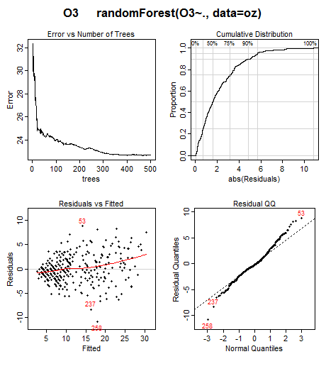

[](https://cran.r-project.org/package=plotmo)
[](https://cran.r-project.org/package=plotmo)

## The plotmo package: Plotting model surfaces

After building a regression or classification model, it's often useful
to plot the model response as the predictors vary.
These model surface plots are helpful for visualizing "black box"
models.

The
[plotmo]( https://CRAN.R-project.org/package=plotmo)
package makes it easy to generate model surfaces for a wide variety of
[R]( https://www.r-project.org)
models, including
[rpart]( https://CRAN.R-project.org/package=rpart),
[gbm]( https://CRAN.R-project.org/package=gbm),
[earth]( https://CRAN.R-project.org/package=earth),
and many others.

## An example model surface

Let's generate a
[randomForest]( https://CRAN.R-project.org/package=randomForest)
model from the well-known ozone dataset.
(We use a random forest for this example, but any model could be
used.)

```r
    library(earth) # for the ozone1 data
    data(ozone1)
    oz <- ozone1[, c("O3", "humidity", "temp")] # simple dataset for illustration
    library(randomForest)
    mod <- randomForest(O3 ~ ., data=oz)
```

We now have a model, but what does it tell us about the relationship
between ozone pollution (O3) and humidity and temperature?
We can visualize this relationship with `plotmo`:

```r
    library(plotmo)
    plotmo(mod)
```


From the plots, we see that ozone increases with humidity and
temperature, although humidity doesn't have much effect at low
temperatures.

## Some details

The top two plots in the above figure are generated by plotting the predicted
response as a variable changes.
Variables that don't appear in a plot are held fixed at their
median values.
Plotmo automatically creates a separate plot for each variable
in the model.

The lower interaction plot shows the predicted response as two
variables are changed (once again with  other variables if any held
at their median values).
Plotmo draws just one interaction plot for this model, since there are
only two variables.

## Partial dependence plots

We can generate `partial dependence` plots by specifying
`pmethod="partdep"` when invoking `plotmo`.
In partial dependence plots, the effect of the background variables is
averaged (instead of simply holding the background variables at their
medians).
Partial dependence plots can be very slow, but they do incorporate
more information about the distribution of the response.

## Plotting model residuals

The `plotres` function is also included in the `plotmo` package.
This function shows residuals and other useful information
about the model, if available.
Using the above model as an example:

```r
    plotres(mod)
```

which gives



Note the "<" shape in the residuals plot in the lower left.
This suggests that we should transform the response before building
the model, maybe by taking the square or cube-root.
Cases 53, 237, and 258 have the largest residuals and perhaps
should be investigated.
This kind of information is not obvious without plotting the residuals

## Miscellaneous

More details and examples may be found in the package vignettes:

- [Plotting regression surfaces with `plotmo`](http://www.milbo.org/doc/plotmo-notes.pdf)

- [Plotting model residuals with `plotres`](http://www.milbo.org/doc/plotres-notes.pdf)

The package also provides a few utility functions such as
`plot_glmnet` and `plot_gbm`.
These functions enhance similar functions in the
[glmnet](https://CRAN.R-project.org/package=glmnet) and
[gbm](https://CRAN.R-project.org/package=gbm)
packages.  Some examples:


## Which models work with plotmo?

Any model that conforms to standard S3 model guidelines will work
with `plotmo`.
Plotmo knows how to deal with logistic, classification,
and multiple response models.
It knows how to handle different `type` arguments to `predict` functions.

Package authors may want to look at
[Guidelines for S3 Regression Models](http://www.milbo.org/doc/modguide.pdf).
If `plotmo` or `plotres` doesn't work with your model, contact the `plotmo` package maintainer.
Often a minor tweak to the model code is all that is needed.

[Stephen Milborrow]( http://www.milbo.users.sonic.net/index.html)
